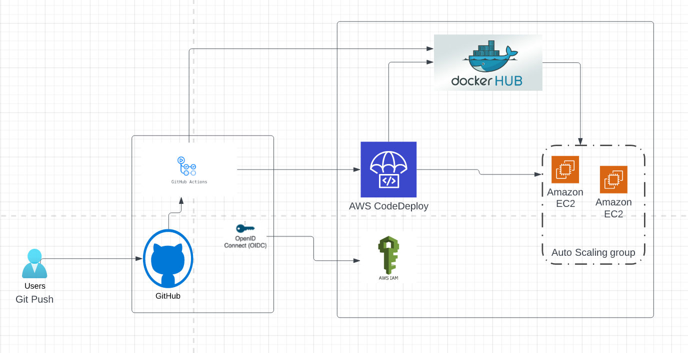
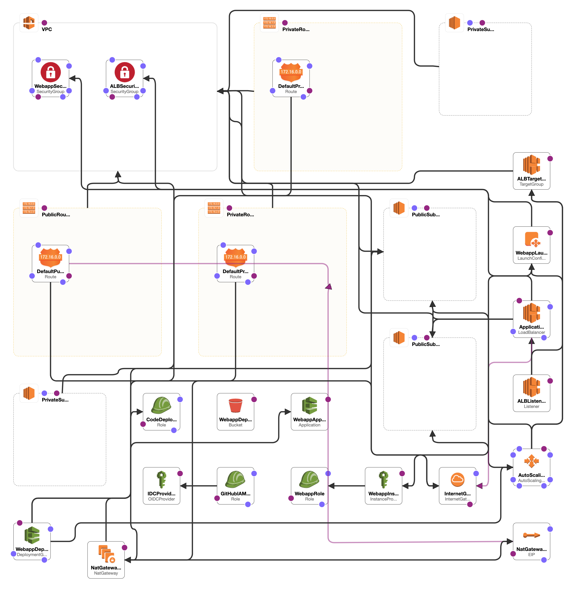
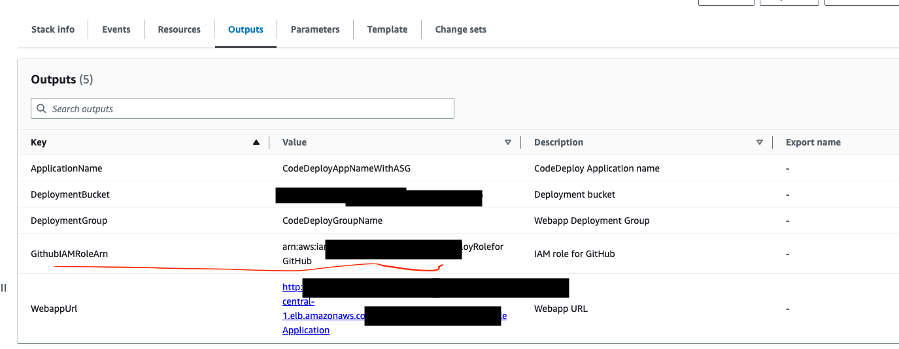
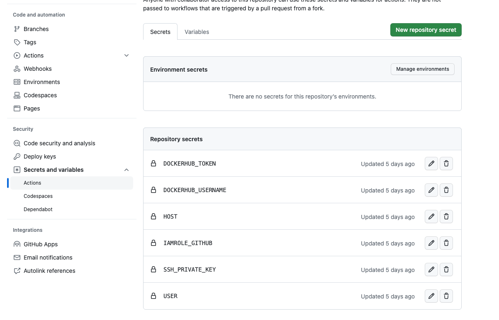
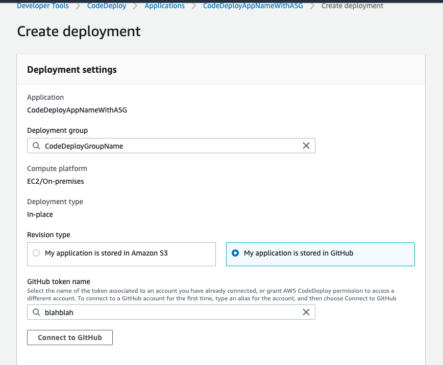
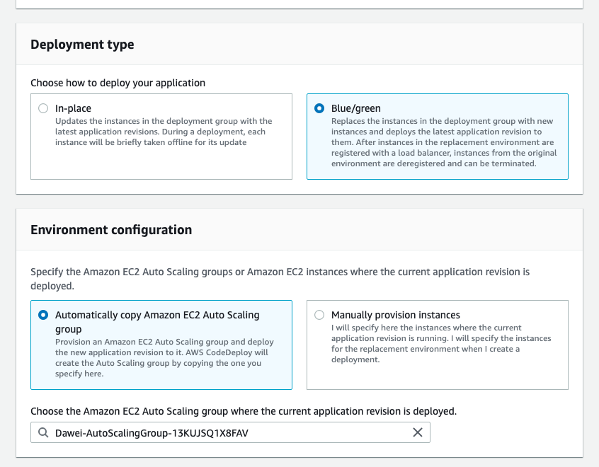
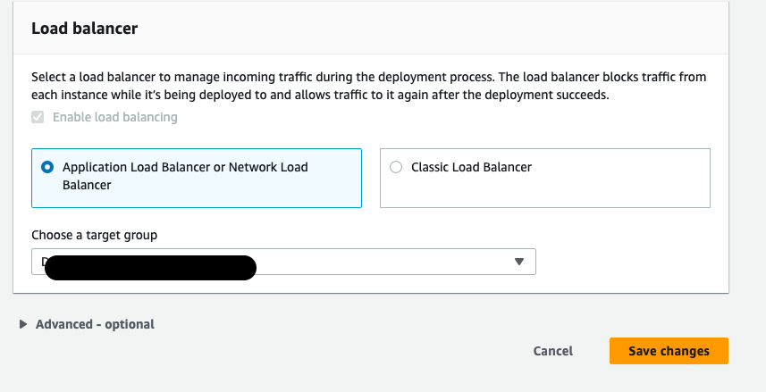

# From DS to MLOPs

From Data Science to MLOPs workshop

# Dataset
## Breast Cancer Wisconsin (Diagnostic) Data Set

For this workshop we are going to work with the following dataset:

https://archive.ics.uci.edu/ml/datasets/Breast+Cancer+Wisconsin+(Diagnostic)

Features are computed from a digitized image of a fine needle aspirate (FNA) of a breast mass. They describe characteristics of the cell nuclei present in the image.
n the 3-dimensional space is that described in: [K. P. Bennett and O. L. Mangasarian: "Robust Linear Programming Discrimination of Two Linearly Inseparable Sets", Optimization Methods and Software 1, 1992, 23-34].

### Attribute Information:

1) ID number
2) Diagnosis (M = malignant, B = benign)
3-32)

Ten real-valued features are computed for each cell nucleus:

a) radius (mean of distances from center to points on the perimeter)
b) texture (standard deviation of gray-scale values)
c) perimeter
d) area
e) smoothness (local variation in radius lengths)
f) compactness (perimeter^2 / area - 1.0)
g) concavity (severity of concave portions of the contour)
h) concave points (number of concave portions of the contour)
i) symmetry
j) fractal dimension ("coastline approximation" - 1)

# Virtual Environment

Firt we need to create a virtual environment for the project, to keep track of every dependency, it is also useful to use and explicit version of Python

Install the package for creating a virtual environment:
`$ pip install virtualenv`

Create a new virtual environment
`$ virtualenv venv`

Activate virtual environment
`$ source venv/bin/activate`

# Python packages

Now with the virtual environment we can install the dependencies written in requirements.txt

`$ pip install -r requirements.txt`

# Train

After we have install all the dependencies we can now run the script in code/train.py, this script takes the input data and outputs a trained model and a pipeline for our web service.

`$ python code/train.py`

# Web application

Finally we can test our web application by running:

`$ flask run -p 5000`

# Docker

Now that we have our web application running, we can use the Dockerfile to create an image for running our web application inside a container

`$ docker build . -t from_ds_to_mlops`

And now we can test our application using Docker

`$ docker run -p 8000:8000 from_ds_to_mlops`

# Test!

Test by using the calls in tests/example_calls.txt from the terminal

# Deploy

The Github Actions will be triggered when the code is pushed to the git repo.
There are 1 build job and 2 jobs about depoyment.
The build job builds a docker image and push it to my Dockerhub registry
One of the deployment is in-place deploy, which would cause a short down time of the application.
The other deployment method is blue-green through AWS CodeDeploy, which is more complicated but it does not have a down time.
In the lab both 2 deployments will be shown.
When you are using one of the deployment method, please comment out the other one.

# Steps
Please store your dockerhub token and your dockerhub username in the repo Settings -> Secrets and variables -> actions-> secrets.

When you are using the in place deployment method, please have an ec2 instance ready with docker installed and configured. Then store the username, the IP address and content of the pem file of the ec2 in repository secrets.

When you are using the blue green deployment method to deploy your application, please create a new stack in the AWS CloudFormation with the template.yaml file in the cloudformation folder of this repository. The KeyName and Stack name can be customized but the other parameters have to kept as default when you are configuring the CloudFormation template parameters.

The cloud formation will cerate a VPC, a launch configuration file, an autoscaling group, an AWS Codedeploy service and some necessary roles.

On the AWS CloudFormation console, select the Outputs tab. Note that the ARN of the GitHub IAM Role will be used in the next step.

Copy the value of this ARN. Then go to your Github repository, create a new secret called IAMROLE_GITHUB and paste the ARN as the content of the secret.

## Integrate CodeDeploy with GitHub:
For CodeDeploy to be able to perform deployment steps using scripts in your repository, it must be integrated with GitHub.

CodeDeploy application and deployment group are already created for you.

Sign in to the AWS Management Console and open the CodeDeploy console at https://console.aws.amazon.com/codedeploy.

In the navigation pane, expand Deploy, then choose Applications.

Choose the application CodeDeployAppNameWithASG to link to a different GitHub account.

Choose CodeDeployGroupName

Click on Create deployment.

In Deployment settings, for Revision type, choose My application is stored in GitHub.

To create a connection for AWS CodeDeploy applications to a GitHub account, sign out of GitHub in a separate web browser tab. In GitHub token name, type a name to identify this connection, and then choose Connect to GitHub. The web page prompts you to authorize CodeDeploy to interact with GitHub for your application. 

Choose Authorize application. GitHub gives CodeDeploy permission to interact with GitHub on behalf of the signed-in GitHub account for the selected application.

Choose cancel because we don't want to create a deployment

Go back to the application CodeDeployGroupName, click on edit

Choose Blue/Green in Deployment type

choose the target group created by the cloudformation stack

Click on Save changes
Push your code to the Github to trigger the workflow